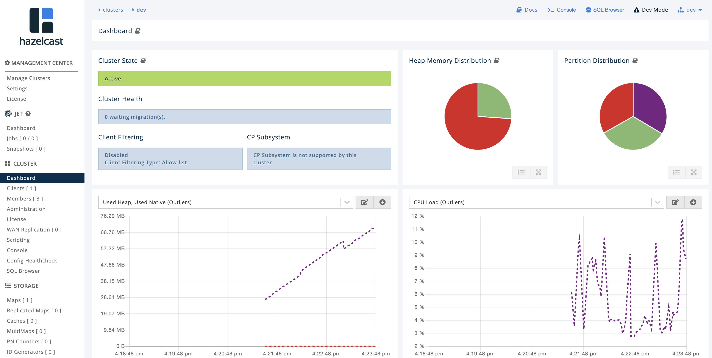

# Hazelcast Operator

Hazelcast Enterprise is packaged with [Operator Framework](https://github.com/operator-framework), which simplifies deployment on Kubernetes and OpenShift. This is a step-by-step guide how to deploy Hazelcast cluster together with Management Center on your Kubernetes or OpenShift cluster.

## Prerequisites

You must have one of the followings:
 * OpenShift cluster (with admin rights) and the `oc` command configured (you may use [Minishift](https://github.com/minishift/minishift))
 * Kubernetes cluster (with admin rights) and the `kubectl` command configured (you may use [Minikube](https://kubernetes.io/docs/getting-started-guides/minikube/))

## OpenShift Deployment steps

Below are the steps to start a Hazelcast Enterprise cluster using Operator Framework. Note that the first 3 steps are usually performed only once for the OpenShift cluster/project (usually by the cluster admin). The step 4 is performed each time you want to create a new Hazelcast cluster.

Note: You need to clone this repository before following the next steps.

    git clone https://github.com/hazelcast/hazelcast-operator.git
    cd hazelcast-operator

#### Step 0: Create project

To create a new project, run the following command.

    oc new-project hazelcast-operator
    
#### Step 1: Create RBAC

Run the following commands to configure the Operator permissions.
   
    # Configure RBAC
    oc apply -f operator-rbac.yaml

Run the following commands to configure the Hazelcast cluster permissions.

    oc apply -f hazelcast-rbac.yaml

#### Step 2: Create CRD (Custom Resource Definition)

To create the Hazelcast resource definition, run the following command.

    oc apply -f hazelcastcluster.crd.yaml

#### Step 3: Deploy Hazelcast Operator

Deploy Hazelcast Enterprise Operator with the following command.

    oc apply -f operator.yaml

#### Step 4: Create Secret with Hazelcast License Key

Use base64 to encode your Hazelcast License Key. If you don't have one, get a trial key from this [link](https://hazelcast.com/hazelcast-enterprise-download/trial/).

    $ echo -n "<hazelcast-license-key>" | base64
    VU5MSU1JVEVEX0xJQ0VOU0UjOTlOb2RlcyMxMjM0NTY3ODlhYmNkZWZnaGlqa2xtbm9wcnN0d3kxMjM0NTY3ODkxMjM0NTY3ODkxMTExMTExMTExMTE=

Insert this value into `secret.yaml`, replace `<base64-hz-license-key>`. Then, create the secret.

    oc apply -f secret.yaml

#### Step 5: Start Hazelcast

Start Hazelcast cluster with the following command.

    oc apply -f hazelcast.yaml

Your Hazelcast Enterprise cluster (together with Management Center) should be created.

    $ oc get all
    NAME                        DESIRED   CURRENT   UP-TO-DATE   AVAILABLE   AGE
    deploy/hazelcast-operator   1         1         1            0           9m

    NAME                              DESIRED   CURRENT   READY     AGE
    rs/hazelcast-operator-b48448568   1         1         0         9m

    NAME                                                    DESIRED   CURRENT   AGE
    statefulsets/hazelcast-hazelcast-enterprise             3         3         6m
    statefulsets/hazelcast-hazelcast-enterprise-mancenter   1         1         6m

    NAME                                            READY     STATUS    RESTARTS   AGE
    po/hazelcast-hazelcast-enterprise-0             1/1       Running   0          6m
    po/hazelcast-hazelcast-enterprise-1             1/1       Running   0          5m
    po/hazelcast-hazelcast-enterprise-2             1/1       Running   0          5m
    po/hazelcast-hazelcast-enterprise-mancenter-0   1/1       Running   0          6m
    po/hazelcast-operator-b48448568-qw4rt           0/1       Running   0          9m

    NAME                                           TYPE           CLUSTER-IP      EXTERNAL-IP   PORT(S)                        AGE
    svc/hazelcast-hazelcast-enterprise             ClusterIP      None            <none>        5701/TCP                       6m
    svc/hazelcast-hazelcast-enterprise-mancenter   LoadBalancer   172.30.110.3    <pending>     8080:30006/TCP,443:30007/TCP   6m
    svc/hazelcast-operator-metrics                 ClusterIP      172.30.98.237   <none>        8686/TCP,8383/TCP              8m

**Note**: In `hazelcast.yaml` you can specify all parameters available in the [Hazelcast Enterprise Helm Chart](https://github.com/hazelcast/charts/tree/master/stable/hazelcast-enterprise).

To connect to Management Center, you can use `EXTERNAL-IP` and open your browser at: `http://<EXTERNAL-IP>:8080/hazelcast-mancenter`. If your OpenShift environment does not have Load Balancer configured, then you can either use `NodePort` or create a route to Management Center with `oc expose`.

## Kubernetes Deployment steps

Below are the steps to start a Hazelcast Enterprise cluster using Operator Framework. Note that the first 3 steps are usually performed only once for the Kubernetes cluster (by the cluster admin). The step 4 is performed each time you want to create a new Hazelcast cluster.

Note: You need to clone this repository before following the next steps.

    git clone https://github.com/hazelcast/hazelcast-operator.git
    cd hazelcast-operator

#### Step 1: Create RBAC

Run the following commands to configure the Operator permissions.

    kubectl apply -f operator-rbac.yaml

Run the following commands to configure the Hazelcast cluster permissions.

    kubectl apply -f hazelcast-rbac.yaml

#### Step 2: Create CRD (Custom Resource Definition)

To create the Hazelcast resource definition, run the following command.

    kubectl apply -f hazelcastcluster.crd.yaml

#### Step 3: Deploy Hazelcast Operator

Deploy Hazelcast Enterprise Operator with the following command.

    kubectl apply -f operator.yaml

#### Step 4: Create Secret with Hazelcast License Key

Use base64 to encode your Hazelcast License Key. If you don't have one, get a trial key from this [link](https://hazelcast.com/hazelcast-enterprise-download/trial/).

    $ echo -n "<hazelcast-license-key>" | base64
    VU5MSU1JVEVEX0xJQ0VOU0UjOTlOb2RlcyMxMjM0NTY3ODlhYmNkZWZnaGlqa2xtbm9wcnN0d3kxMjM0NTY3ODkxMjM0NTY3ODkxMTExMTExMTExMTE=

Insert this value into `secret.yaml`, replace `<base64-hz-license-key>`. Then, create the secret.

    kubectl apply -f secret.yaml

#### Step 5: Start Hazelcast

Start Hazelcast cluster with the following command.

    kubectl apply -f hazelcast.yaml

Your Hazelcast Enterprise cluster (together with Management Center) should be created.

    $ kubectl get all
    NAME                                                                  READY   STATUS    RESTARTS   AGE
    pod/hazelcast-operator-79468c667-lz96b                                1/1     Running   0          6m
    pod/hazelcast-hazelcast-enterprise-0                                  1/1     Running   0          3m
    pod/hazelcast-hazelcast-enterprise-1                                  1/1     Running   0          2m
    pod/hazelcast-hazelcast-enterprise-2                                  1/1     Running   0          1m
    pod/hazelcast-hazelcast-enterprise-mancenter-0                        1/1     Running   0          1m
    
    NAME                                                                  TYPE           CLUSTER-IP      EXTERNAL-IP      PORT(S)          AGE
    service/hazelcast-hazelcast-enterprise                                ClusterIP      None            <none>           5701/TCP         1m
    service/hazelcast-hazelcast-enterprise-mancenter                      LoadBalancer   10.19.240.2     35.184.181.188   8080:31383/TCP   1m
    service/kubernetes                                                    ClusterIP      10.19.240.1     <none>           443/TCP          39m
    
    NAME                                                    DESIRED   CURRENT   AGE
    statefulsets/hazelcast-hazelcast-enterprise             3         3         6m
    statefulsets/hazelcast-hazelcast-enterprise-mancenter   1         1         6m

    NAME                                 DESIRED   CURRENT   UP-TO-DATE   AVAILABLE   AGE
    deployment.apps/hazelcast-operator   1         1         1            0           9m

    NAME                                           DESIRED   CURRENT   READY     AGE
    replicaset.apps/hazelcast-operator-b48448568   1         1         0         9m

**Note**: In `hazelcast.yaml` you can specify all parameters available in the [Hazelcast Enterprise Helm Chart](https://github.com/hazelcast/charts/tree/master/stable/hazelcast-enterprise).

To connect to Management Center, you can use `EXTERNAL-IP` and open your browser at: `http://<EXTERNAL-IP>:8080/hazelcast-mancenter`. If your Kubernetes environment does not have Load Balancer configured, then please use `NodePort` or `Ingress`.

## Configuration

You may want to modify the behavior of the Hazelcast Operator.

#### Changing Hazelcast and Management Center version

If you want to modify the Hazelcast or Management Center version, update the following part in `hazelcast.yaml`.

    spec:
      image:
        tag: <hazelcast-version>
      mancenter:
        image:
          tag: <management-center-version>

## Troubleshooting

Kubernetes/OpenShift clusters are deployed in many different ways and you may encounter some of the following issues in some environments.

#### Invalid value runAsUser

Some of the OpenShift environments may have the restriction on the User ID used for the container.

    $ oc describe statefulsets/my-hz-ewvci29k7k5itktwi20m35e3b-hazelcast-enterprise
    Warning  FailedCreate  28m (x13 over 28m)  statefulset-controller  create Pod my-hz-a2rqj3ai7p1ircbl9u7rr5riv-hazelcast-enterprise-0 in StatefulSet my-hz-a2rqj3ai7p1i
    rcbl9u7rr5riv-hazelcast-enterprise failed error: pods "my-hz-a2rqj3ai7p1ircbl9u7rr5riv-hazelcast-enterprise-0" is forbidden: unable to validate against any security con
    text constraint: [spec.containers[0].securityContext.securityContext.runAsUser: Invalid value: 65534: must be in the ranges: [1000170000, 1000179999]]
    
Then, please update your `hazelcast.yaml` with the valid `runAsUser` and `fsGroup` values.

    apiVersion: hazelcast.com/v1alpha1
    kind: Hazelcast
    metadata:
      name: hz
    spec:
      image:
        tag: "3.11.2"
      hazelcast:
        licenseKeySecretName: "hz-license-key-secret"
      serviceAccount:
        create: false
        name: hazelcast
      securityContext:
        runAsUser: 1000160000
        fsGroup: 1000160000

Note: You can find the current UID range for your project with the following command `oc describe project <project-name> | grep openshift.io/sa.scc.uid-range`.

#### Invalid value: must be no more than 63 characters

In the sample `hazelcast.yaml`, the name of the Hazelcast cluster is `hz`. If you make this value longer, you may encounter the following error.

    oc describe statefulset.apps/my-hazelcast-2esqhajupdg5002uqwgoc8jnj-hazelcast-enterprise
     
    .......Invalid value: "my-hazelcast-2esqhajupdg5002uqwgoc8jnj-hazelcast-enterprise-74cf94b5": must be no more than 63 characters
    
This is the issue of the Operator itself, so there is not better solution for now than giving your cluster a short name.

#### WriteNotAllowedException in Management Center

Some of the OpenShift environments may have the restriction on the User ID used in volume mounts, which may cause the following exception in Management Center.

    Caused by: com.hazelcast.webmonitor.service.exception.WriteNotAllowedException: WARNING: /data can not be created. Either make it writable, or set "hazelcast.mancenter.
    home" system property to a writable directory and restart.
            at com.hazelcast.webmonitor.service.HomeDirectoryProviderImpl.constructDirectory(HomeDirectoryProviderImpl.java:63)
            at com.hazelcast.webmonitor.service.HomeDirectoryProviderImpl.<init>(HomeDirectoryProviderImpl.java:25)
            at sun.reflect.NativeConstructorAccessorImpl.newInstance0(Native Method)
            at sun.reflect.NativeConstructorAccessorImpl.newInstance(NativeConstructorAccessorImpl.java:62)
            at sun.reflect.DelegatingConstructorAccessorImpl.newInstance(DelegatingConstructorAccessorImpl.java:45)
            at java.lang.reflect.Constructor.newInstance(Constructor.java:423)
            at org.springframework.beans.BeanUtils.instantiateClass(BeanUtils.java:142)
            ... 66 common frames omitted

In such case, please update your `hazelcast.yaml` with the valid `runAsUser` and `fsGroup` values.

    apiVersion: hazelcast.com/v1alpha1
    kind: Hazelcast
    metadata:
      name: hz
    spec:
      image:
        tag: "3.11.2"
      hazelcast:
        licenseKeySecretName: "hz-license-key-secret"
      serviceAccount:
        create: false
        name: hazelcast
      securityContext:
        runAsUser: 1000160000
        fsGroup: 1000160000

Note: You can find the UID range for your project with the following command `oc describe project <project-name> | grep openshift.io/sa.scc.uid-range`.
