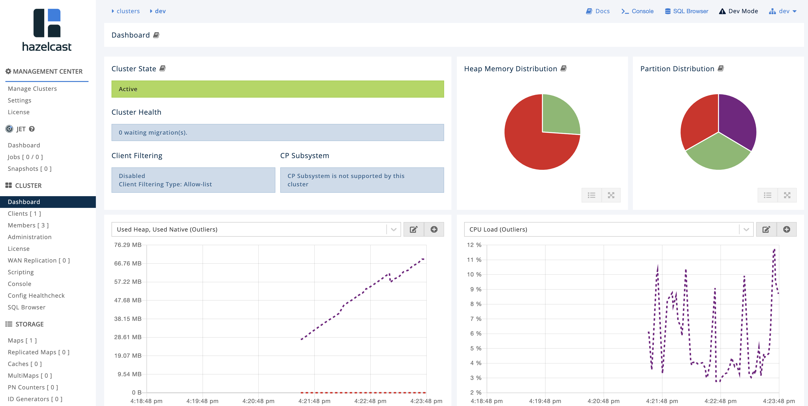

# Hazelcast Enterprise Operator

This is a step-by-step guide how to deploy Hazelcast Enterprise cluster (together with Management Center) on your OpenShift or Kubernetes cluster.

## Prerequisites

You must have one of the followings:
 * OpenShift cluster (with admin rights) and the `oc` command configured (you may use [Minishift](https://github.com/minishift/minishift))
 * Kubernetes cluster (with admin rights) and the `kubectl` command configured (you may use [Minikube](https://kubernetes.io/docs/getting-started-guides/minikube/))

 Versions compatibility:
 * hazelcast-enterprise-operator 0.2+ is compatible with hazelcast 4+
 * for older hazelcast versions, use hazelcast-enterprise-operator 0.1.x

## Security Context Constraints (SCC) Requirements

Hazelcast uses Redhat shipped `restricted` SCC which :

- Ensures that pods cannot run as privileged.
- Ensures that pods cannot mount host directory volumes.
- Requires that a pod run as a user in a pre-allocated range of UIDs.
- Requires that a pod run with a pre-allocated MCS label.
- Allows pods to use any FSGroup.
- Allows pods to use any supplemental group.

You can refer to [Openshift Documentation](https://docs.openshift.com/) for more details.

## OpenShift Deployment steps

Below are the steps to start a Hazelcast Enterprise cluster using Operator Framework. Note that the first 4 steps are usually performed only once for the OpenShift cluster/project (usually by the cluster admin). The step 5 is performed each time you want to create a new Hazelcast cluster.

Note: You need to clone this repository before following the next steps.

    git clone https://github.com/hazelcast/hazelcast-operator.git
    cd hazelcast-operator/hazelcast-enterprise-operator

Note: By default the communication is not secured. To enable SSL, read the [Configuring SSL](#configuring-ssl) section.

#### Step 0: Create project

To create a new project, run the following command.

    oc new-project hazelcast-operator
    
#### Step 1: Create RBAC

Run the following command to configure the Operator permissions.
   
    oc apply -f operator-rbac.yaml

Run the following command to configure the Hazelcast cluster permissions.

    oc apply -f hazelcast-rbac.yaml

#### Step 2: Create CRD (Custom Resource Definition)

To create the HazelcastEnterprise resource definition, run the following command.

    oc apply -f hazelcastcluster.crd.yaml


#### Step 3: Deploy Hazelcast Enterprise Operator

Deploy Hazelcast Enterprise Operator with the following command.

    oc apply -f operator-rhel.yaml

Note that if you prefer Docker Hub images, you can use `operator-docker-hub.yaml` instead.

#### Step 4: Create Secret with Hazelcast License Key

Use base64 to encode your Hazelcast License Key. If you don't have one, get a trial key from this [link](https://hazelcast.com/hazelcast-enterprise-download/trial/).

    $ echo -n "<hazelcast-license-key>" | base64
    VU5MSU1JVEVEX0xJQ0VOU0UjOTlOb2RlcyMxMjM0NTY3ODlhYmNkZWZnaGlqa2xtbm9wcnN0d3kxMjM0NTY3ODkxMjM0NTY3ODkxMTExMTExMTExMTE=

Insert this value into `secret.yaml`, replace `<base64-hz-license-key>`. Then, create the secret.

    oc apply -f secret.yaml

#### Step 5: Start Hazelcast

Start Hazelcast cluster with the following command.

    oc apply -f hazelcast.yaml

Your Hazelcast Enterprise cluster (together with Management Center) should be created.

    $ oc get pods
    NAME                                             READY     STATUS    RESTARTS   AGE
    hazelcast-enterprise-operator-7965b9d785-wst5k   1/1       Running   0          2m39s
    hz-hazelcast-enterprise-0                        1/1       Running   0          2m6s
    hz-hazelcast-enterprise-1                        1/1       Running   0          86s
    hz-hazelcast-enterprise-2                        1/1       Running   0          44s
    hz-hazelcast-enterprise-mancenter-0              1/1       Running   0          2m6s


**Note**: In `hazelcast.yaml` you can specify all parameters available in the [Hazelcast Enterprise Helm Chart](https://github.com/hazelcast/charts/tree/master/stable/hazelcast-enterprise).

**Note** also that you cannot create multiple Hazelcast clusters with the same name.

To connect to Management Center, you can use `EXTERNAL-IP` and open your browser at: `http://<EXTERNAL-IP>:8080/hazelcast-mancenter`. If your OpenShift environment does not have Load Balancer configured, then you can create a route to Management Center with `oc expose`.



## Kubernetes Deployment steps

Below are the steps to start a Hazelcast Enterprise cluster using Operator Framework. Note that the first 4 steps are usually performed only once for the Kubernetes cluster (by the cluster admin). The step 5 is performed each time you want to create a new Hazelcast cluster.

Note: You need to clone this repository before following the next steps.

    git clone https://github.com/hazelcast/hazelcast-operator.git
    cd hazelcast-operator/hazelcast-enterprise-operator

#### Step 1: Create RBAC

Run the following commands to configure the Operator permissions.

    kubectl apply -f operator-rbac.yaml

Run the following commands to configure the Hazelcast cluster permissions.

    kubectl apply -f hazelcast-rbac.yaml

#### Step 2: Create CRD (Custom Resource Definition)

To create the Hazelcast resource definition, run the following command.

    kubectl apply -f hazelcastcluster.crd.yaml

#### Step 3: Deploy Hazelcast Enterprise Operator

Deploy Hazelcast Enterprise Operator with the following command.

    kubectl --validate=false apply -f operator-docker-hub.yaml

#### Step 4: Create Secret with Hazelcast License Key

Use base64 to encode your Hazelcast License Key. If you don't have one, get a trial key from this [link](https://hazelcast.com/hazelcast-enterprise-download/trial/).

    $ echo -n "<hazelcast-license-key>" | base64
    VU5MSU1JVEVEX0xJQ0VOU0UjOTlOb2RlcyMxMjM0NTY3ODlhYmNkZWZnaGlqa2xtbm9wcnN0d3kxMjM0NTY3ODkxMjM0NTY3ODkxMTExMTExMTExMTE=

Insert this value into `secret.yaml`, replace `<base64-hz-license-key>`. Then, create the secret.

    kubectl apply -f secret.yaml

#### Step 5: Start Hazelcast

Start Hazelcast cluster with the following command.

    kubectl apply -f hazelcast.yaml

Your Hazelcast Enterprise cluster (together with Management Center) should be created.

    $ kubectl get pods
    NAME                                                                  READY   STATUS    RESTARTS   AGE
    pod/hazelcast-enterprise-operator-79468c667-lz96b                     1/1     Running   0          6m
    pod/hz-hazelcast-enterprise-0                                         1/1     Running   0          3m
    pod/hz-hazelcast-enterprise-1                                         1/1     Running   0          2m
    pod/hz-hazelcast-enterprise-2                                         1/1     Running   0          1m
    pod/hz-hazelcast-enterprise-mancenter-0                               1/1     Running   0          1m

**Note**: In `hazelcast.yaml` you can specify all parameters available in the [Hazelcast Enterprise Helm Chart](https://github.com/hazelcast/charts/tree/master/stable/hazelcast-enterprise).

**Note** also that you cannot create multiple Hazelcast clusters with the same name.

To connect to Management Center, you can use `EXTERNAL-IP` and open your browser at: `http://<EXTERNAL-IP>:8080/hazelcast-mancenter`. If your Kubernetes environment does not have Load Balancer configured, then please use `NodePort` or `Ingress`.


## Configuration

You may want to modify the behavior of the Hazelcast Enterprise Operator.

#### Changing Hazelcast and Management Center version

If you want to modify the Hazelcast or Management Center version, update `RELATED_IMAGE_HAZELCAST` and `RELATED_IMAGE_MANCENTER` environment variables in `operator-rhel.yaml` (or `operator-docker-hub.yaml`).

#### Configuring Hazelcast Cluster

You can check all configuration options in `hazelcast-full.yaml`. Description of all parameters can be found [here](https://github.com/hazelcast/charts/tree/master/stable/hazelcast-enterprise#configuration).

#### Configuring SSL

By default the communication is not secured. To enable SSL-protected communication between members and clients, you need first to provide the keys and certificates as a secret.

For example, if you use keystore/truststore, then you can import them with the following OpenShift command.

    $ oc create secret generic keystore --from-file=./keystore --from-file=./truststore

The same command for Kubernetes looks as follows. 

    $ kubectl create secret generic keystore --from-file=./keystore --from-file=./truststore

Instead of manually creating keystore/truststore, you can use [cert-manager](https://cert-manager.io/docs/) to automatically create a secret with related keys (note that dynamic keys update is supported only while using `OpenSSL`, check more [here](https://docs.hazelcast.org/docs/latest/manual/html-single/#integrating-openssl-boringssl)).

Then, use the following Hazelcast configuration.

    apiVersion: hazelcast.com/v1alpha1
    kind: HazelcastEnterprise
    metadata:
      name: hz
    spec:
    ...
      secretsMountName: keystore
      hazelcast:
        yaml:
          hazelcast:
            network:
              ssl:
                enabled: true
                properties:
                  keyStore: /data/secrets/keystore
                  keyStorePassword: <keystore_password>
                  trustStore: /data/secrets/truststore
                  trustStorePassword: <truststore_password>
      livenessProbe:
        scheme: HTTPS
      readinessProbe:
        scheme: HTTPS
      mancenter:
        ssl: true
        secretsMountName: keystore
        yaml:
          hazelcast-client:
            network:
              ssl:
                enabled: true
                properties:
                  keyStore: /secrets/keystore
                  keyStorePassword: <keystore_password>
                  trustStore: /secrets/truststore
                  trustStorePassword: <truststore_password>
        javaOpts: -Dhazelcast.mc.tls.keyStore=/secrets/keystore -Dhazelcast.mc.tls.keyStorePassword=<keystore_password>
        service:
          httpsPort: 8443

Additionally, if you need Mutual Authentication for Management Center, you can add the following parameters to `mancenter.javaOpts`.

```
-Dhazelcast.mc.tls.trustStore=/secrets/truststore -Dhazelcast.mc.tls.trustStorePassword=<truststore_password> -Dhazelcast.mc.tls.mutualAuthentication=REQUIRED
```

For more information on Hazelcast Security check the following resources:

* [Hazelcast Reference Manual - Security](https://docs.hazelcast.org/docs/latest/manual/html-single/#security)
* [Management Center Reference Manual - Security](https://docs.hazelcast.org/docs/management-center/latest/manual/html/index.html#configuring-and-enabling-security)
* [Hazelcast Code Sample - Hazelcast with SSL on Kubernetes](https://github.com/hazelcast/hazelcast-code-samples/tree/master/hazelcast-integration/kubernetes/samples/ssl)

## Troubleshooting

Kubernetes/OpenShift clusters are deployed in many different ways and you may encounter some of the following issues in some environments.

#### Invalid value: must be no more than 63 characters

In the sample `hazelcast.yaml`, the name of the Hazelcast cluster is `hz`. If you make this value longer, you may encounter the following error.

    oc describe statefulset.apps/my-hazelcast-2esqhajupdg5002uqwgoc8jnj-hazelcast-enterprise
     
    .......Invalid value: "my-hazelcast-2esqhajupdg5002uqwgoc8jnj-hazelcast-enterprise-74cf94b5": must be no more than 63 characters
    
This is the issue of the Operator itself, so there is not better solution for now than giving your cluster a short name.

#### WriteNotAllowedException in Management Center

Some of the OpenShift environments may have the restriction on the User ID used in volume mounts, which may cause the following exception in Management Center.

    Caused by: com.hazelcast.webmonitor.service.exception.WriteNotAllowedException: WARNING: /data can not be created. Either make it writable, or set "hazelcast.mancenter.
    home" system property to a writable directory and restart.
            at com.hazelcast.webmonitor.service.HomeDirectoryProviderImpl.constructDirectory(HomeDirectoryProviderImpl.java:63)
            at com.hazelcast.webmonitor.service.HomeDirectoryProviderImpl.<init>(HomeDirectoryProviderImpl.java:25)
            at sun.reflect.NativeConstructorAccessorImpl.newInstance0(Native Method)
            at sun.reflect.NativeConstructorAccessorImpl.newInstance(NativeConstructorAccessorImpl.java:62)
            at sun.reflect.DelegatingConstructorAccessorImpl.newInstance(DelegatingConstructorAccessorImpl.java:45)
            at java.lang.reflect.Constructor.newInstance(Constructor.java:423)
            at org.springframework.beans.BeanUtils.instantiateClass(BeanUtils.java:142)
            ... 66 common frames omitted

In such case, please update your `hazelcast.yaml` with the valid `runAsUser` and `fsGroup` values.

    apiVersion: hazelcast.com/v1alpha1
    kind: HazelcastEnterprise
    metadata:
      name: hz
    spec:
    ...
      securityContext:
        runAsUser: 1000160000
        fsGroup: 1000160000

Note: You can find the UID range for your project with the following command `oc describe project <project-name> | grep openshift.io/sa.scc.uid-range`.
